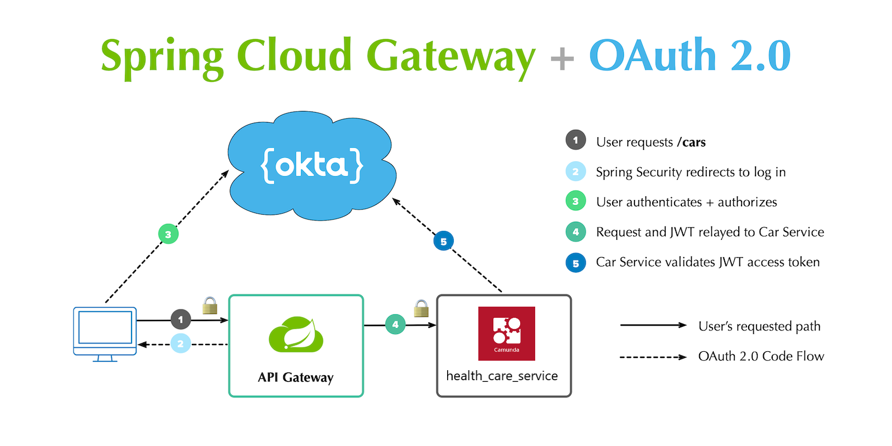
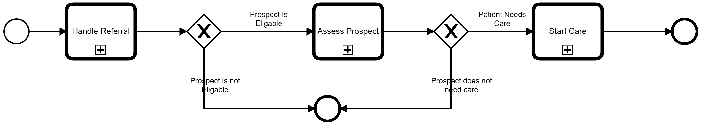
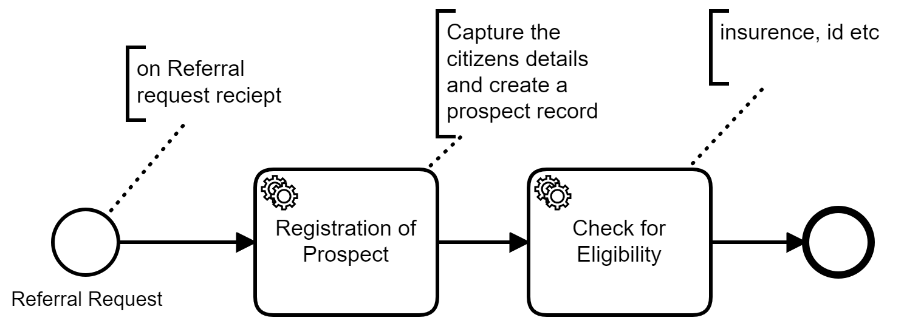

# Health Care System
This is an architectural proof of concept of a microservices based architecture for implementation in the health care space.

### Installation

Application requires java, maven, optinally Camunda [Camunda](https://camunda.com/download/) for viewing and editing processes.

Install the dependencies and devDependencies and start the server.

```sh
$ git clone https://github.com/shlapolosa/health-service.git
$ cd health-service
$ mvn clean install -DskipTests=true
$ mvn spring-boot:run inside, discovery-server, api-gateway, healh-care-service
```
Once the service is up and running, test using postman;
[](https://app.getpostman.com/run-collection/0f452db22527a235a9b5)

# Note!
You would have to update application.properties with the correct okta application details first in each project
Always run in incognito to get the access token.
Need to have a webapp application which allows for username and password credential login, also need
a service application for interservice communication;
webapp application - profile claim
service application - client_credentials claim, customer scope and uses secrete and client id only.

### Tech
## Application Architecture conceptual view



> The overriding design goal is;
> Offer SSO capability and an user management though oath2 with okta as a provider and jwt based authentication
> Use an application gateway to fascade all the resources behind a uniform api using zuul
> Do service discovery through eurika to decouple all services

## Business Processes
Health Care process




> this is the overral process
Referral Process
> sub-process that just for creating a prospect and verifying them





> Testing the orchastration of the entire process through bpm
> this allows for handling of events, synchronous process eg. creation of prospect, asynchronous process eg. verify medical insurance and tracebility of what exactly is happening with this referral.
> Camunda used for the bpm process because of its distributed and lightweight features


